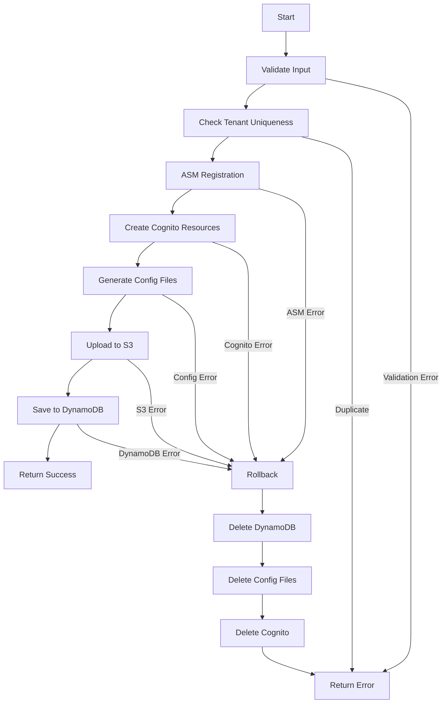

# Tenant Provisioning Lambda

Complete tenant provisioning Lambda function for multi-tenant architecture with automatic rollback on failure.

## Overview

This Lambda function handles the complete provisioning of a new tenant, including:
- ASM portal registration
- Cognito UserPool and client creation
- Configuration file generation and upload
- DynamoDB entry creation
- Automatic rollback on any failure

## Architecture

```
┌─────────────────────────────────────────────────────────────┐
│ Admin Portal UI                                             │
│   └─> POST /tenants                                         │
└────────────────────────┬────────────────────────────────────┘
                         │
                         ▼
┌─────────────────────────────────────────────────────────────┐
│ provision-tenant Lambda (this function)                     │
│                                                             │
│  1. Validate input                                          │
│  2. Check tenant doesn't exist                              │
│  3. ASM registration (or reuse)                             │
│  4. Create Cognito resources                                │
│  5. Generate & upload config files                          │
│  6. Save to DynamoDB                                        │
│  7. Return success OR rollback everything                   │
└─────────────────────────────────────────────────────────────┘
```

## Modules

### `index.mjs`
Main orchestrator that coordinates all provisioning steps.

### `validation.mjs`
Input validation:
- Tenant ID format (alphanumeric, max 36 chars)
- Email validation
- Required field checks
- XSS prevention

### `asm-registration.mjs`
ASM portal integration:
- Checks for existing registration
- Registers new tenant if needed
- Stores credentials in Secrets Manager
- Retry logic for network failures

### `cognito-provisioning.mjs`
Cognito resource creation:
- UserPool with password policies
- SAML client (with secret)
- SP Portal client (public)
- OAuth domain

### `config-generator.mjs`
Configuration file generation:
- `awsconfig_<tenantId>.json` - AWS/Cognito config
- `branding_<tenantId>.json` - UI branding
- Uploads to shared S3 bucket
- Invalidates CloudFront cache

### `dynamodb-operations.mjs`
Database operations:
- Save tenant data
- Check existence
- Delete (for rollback)

### `rollback.mjs`
Automatic cleanup:
- Deletes DynamoDB entry
- Removes config files from S3
- Deletes Cognito UserPool (cascades to clients)
- Keeps ASM registration (reusable)

## Environment Variables

| Variable | Required | Description |
|----------|----------|-------------|
| `AWS_REGION` | Yes | AWS region |
| `AWS_ACCOUNT` | Yes | AWS account ID |
| `AMFATENANT_TABLE` | Yes | DynamoDB table name |
| `ASM_PORTAL_URL` | Yes | ASM portal URL |
| `ASM_SECRET_KEY` | Yes | ASM installation key |
| `ROOT_DOMAIN` | Yes | Root domain (e.g., example.com) |
| `ADMIN_EMAIL` | Yes | Admin email for notifications |
| `INSTALLER_EMAIL` | No | Installer email (defaults to ADMIN_EMAIL) |
| `SP_PORTAL_BUCKET` | Yes | S3 bucket for SP portal files |
| `CLOUDFRONT_DISTRIBUTION_ID` | Yes | CloudFront distribution ID |
| `DEFAULT_LOGO` | No | Default logo URL |
| `DEFAULT_PRIMARY_COLOR` | No | Default primary color |
| `DEFAULT_SECONDARY_COLOR` | No | Default secondary color |

## Input Format

```json
{
  "body": {
    "tenantId": "acme-prod",
    "tenantName": "Acme Production",
    "contactEmail": "admin@acme.com",
    "orgId": "acme",
    "samlproxy": true,
    "adminEmail": "admin@acme.com",
    "adminFirstName": "John",
    "adminLastName": "Doe"
  }
}
```

## Success Response

```json
{
  "statusCode": 200,
  "body": {
    "success": true,
    "message": "Tenant 'acme-prod' provisioned successfully",
    "data": {
      "tenantId": "acme-prod",
      "tenantName": "Acme Production",
      "orgId": "acme",
      "url": "https://acme-prod.example.com",
      "userPoolId": "us-east-1_abc123",
      "spPortalClientId": "abc123xyz",
      "awsConfigUrl": "https://acme-prod.example.com/awsconfig_acme-prod.json",
      "brandingUrl": "https://acme-prod.example.com/branding_acme-prod.json",
      "provisioningTime": "45230ms",
      "status": "active"
    }
  }
}
```

## Error Response

```json
{
  "statusCode": 400,
  "body": {
    "success": false,
    "message": "Tenant provisioning failed",
    "error": "Validation failed: tenantId must be alphanumeric",
    "tenantId": "acme-prod",
    "provisioningTime": "1250ms",
    "rollbackPerformed": true,
    "validationErrors": [
      "tenantId must be alphanumeric and max 36 characters"
    ]
  }
}
```

## Provisioning Flow



## Rollback Behavior

The Lambda uses a transaction-like approach:
1. **Logs each successful step** in `provisioningLog`
2. **On any failure**, processes log in reverse order
3. **Continues rollback** even if individual steps fail
4. **Validates cleanup** after rollback completes

### What Gets Rolled Back
- ✅ DynamoDB entry (deleted)
- ✅ Config files in S3 (deleted)
- ✅ Cognito UserPool (deleted, cascades to clients)
- ❌ ASM registration (kept for reuse)

## Performance

| Step | Typical Duration | Notes |
|------|------------------|-------|
| Validation | <100ms | Input validation |
| ASM Registration | 2-5s | Network call, with retry |
| Cognito Creation | 5-10s | UserPool + 2 clients |
| Config Upload | 1-2s | S3 + CloudFront invalidation |
| DynamoDB Save | 200-500ms | Single put operation |
| **Total** | **10-20s** | Much faster than old approach (30+ min) |

## Error Handling

### Transient Errors (Retried)
- Network timeouts
- Rate limiting
- S3 throttling

### Permanent Errors (Immediate Failure)
- Validation errors (400)
- Duplicate tenant (409)
- Missing permissions (403)
- Resource quota exceeded (429)

## Testing

### Local Testing
```bash
# Install dependencies
npm install

# Set environment variables
export AWS_REGION=us-east-1
export AMFATENANT_TABLE=tenant-table
# ... other env vars

# Test with sample event
node -e "
import('./index.mjs').then(m => {
  const event = {
    body: JSON.stringify({
      tenantId: 'test',
      tenantName: 'Test Tenant',
      contactEmail: 'test@example.com',
      orgId: 'testorg'
    })
  };
  return m.handler(event);
}).then(console.log);
"
```

### Health Check
```bash
# Test Lambda is working
aws lambda invoke \
  --function-name provision-tenant \
  --payload '{"health":true}' \
  response.json
```

## Monitoring

### CloudWatch Metrics
- Invocations
- Duration
- Errors
- Throttles

### Custom Logs
```
[PROVISION] - Main flow logs
[STEP X/6] - Individual step logs
[ASM] - ASM registration logs
[Cognito] - Cognito operation logs
[Config] - Config generation logs
[DynamoDB] - Database operation logs
[ROLLBACK] - Rollback operation logs
```

### Alarms (Recommended)
- Error rate > 5%
- Duration > 60s (P99)
- Rollback frequency > 10%

## Security

### IAM Permissions Required
```json
{
  "Version": "2012-10-17",
  "Statement": [
    {
      "Effect": "Allow",
      "Action": [
        "cognito-idp:*",
        "dynamodb:PutItem",
        "dynamodb:GetItem",
        "dynamodb:DeleteItem",
        "s3:PutObject",
        "s3:DeleteObject",
        "cloudfront:CreateInvalidation",
        "secretsmanager:CreateSecret",
        "secretsmanager:GetSecretValue"
      ],
      "Resource": "*"
    }
  ]
}
```

### Secrets Management
- ASM credentials stored in Secrets Manager
- Cognito client secrets encrypted at rest
- No secrets in logs or responses

## Troubleshooting

### Common Issues

**1. "Tenant already exists"**
- Check DynamoDB for existing entry
- Verify tenant wasn't partially provisioned

**2. "ASM registration failed"**
- Verify ASM_SECRET_KEY is correct
- Check network connectivity to ASM portal
- Review ASM portal logs

**3. "Cognito creation failed"**
- Check Cognito service limits
- Verify IAM permissions
- Review Cognito quota for account

**4. "Config upload failed"**
- Verify S3 bucket exists
- Check S3 bucket permissions
- Ensure bucket is in same region

**5. "Rollback incomplete"**
- Check CloudWatch logs for specific failures
- Manually clean up remaining resources
- Verify IAM permissions for delete operations

## Deployment

This Lambda is deployed via CDK. See parent directory's CDK code for integration.

## Version History

- **2.0.0** - Multi-tenant shared infrastructure
  - Single SP portal for all tenants
  - Config file-based approach
  - Improved rollback logic
- **1.0.0** - Per-tenant infrastructure
  - Separate CloudFront/S3 per tenant
  - SSM Parameter Store

## License

UNLICENSED - Internal use only
